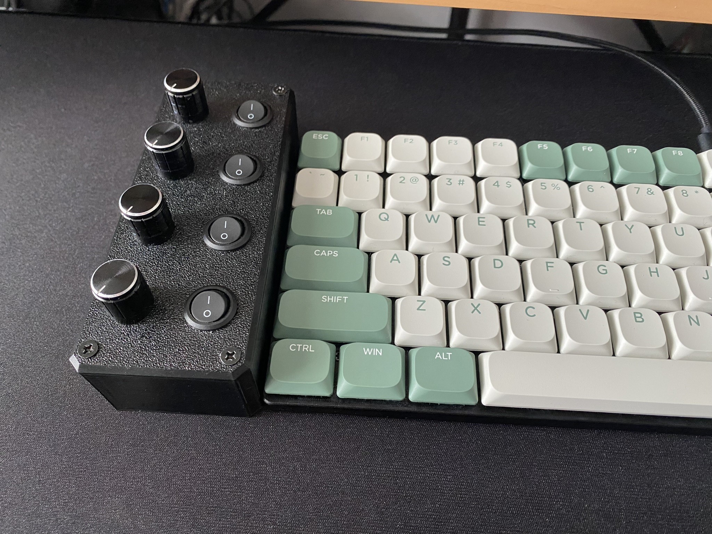
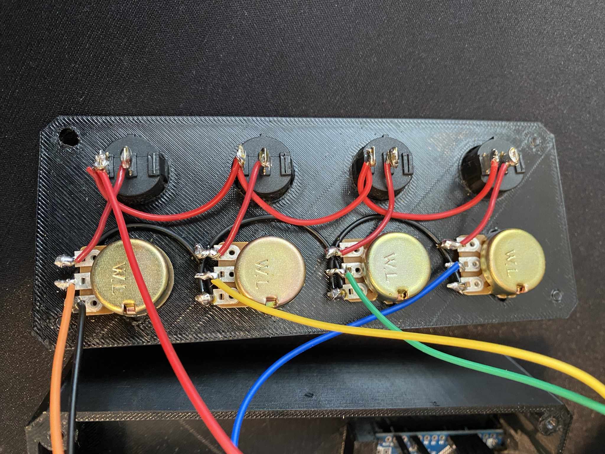
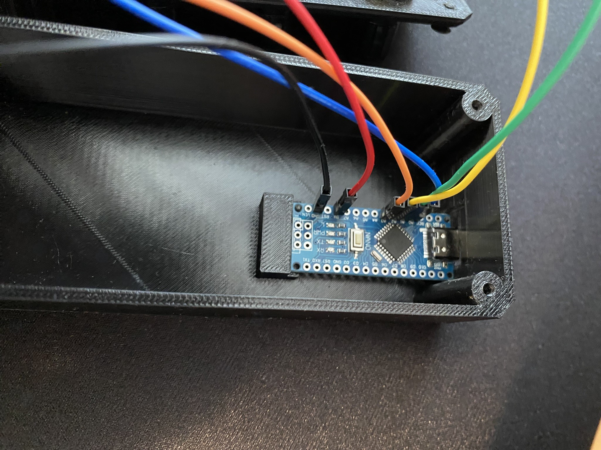

# DEEJ
Project based on https://github.com/omriharel/DEEJ

Case based on https://www.thingiverse.com/thing:4888445

Thingiverse link https://www.thingiverse.com/thing:6710745

## Parts List:
- [Mini / Type-C / Micro USB Nano 3.0 With the bootloader compatible Nano controller for arduino CH340 USB driver 16Mhz ATMEGA328P](https://www.aliexpress.com/item/1005006053215107.html?spm=a2g0o.order_list.order_list_main.83.c6dc1802HPzLbS)

- [5Set WH148 Potentiometer 15mm 3pin with Black Aluminum Alloy Knob Cap 1K 2K 5K 10K 20K 50K 100K 250K 1M Linear Potentiometer Kit](https://www.aliexpress.com/item/1005005779765175.html?spm=a2g0o.order_list.order_list_main.98.c6dc1802HPzLbS)

- [10Pcs SPST Snap-in Toggle Switch ON Off 2 Pin Round Rocker Boat On/off Switch AC 3A 250V 6A 125V for Car Auto Boat Switches](https://www.aliexpress.com/item/1005004608439621.html?spm=a2g0o.order_list.order_list_main.88.c6dc1802HPzLbS)

- [40 / 120pcs 40PIN 20CM Dupont Line Male to Male + Female and Female to Female Jumper Dupont Wire Cable For Arduino DIY KIT](https://www.aliexpress.com/item/1005005945668553.html?spm=a2g0o.order_list.order_list_main.113.c6dc1802HPzLbS)

## Photos

## Schematic
